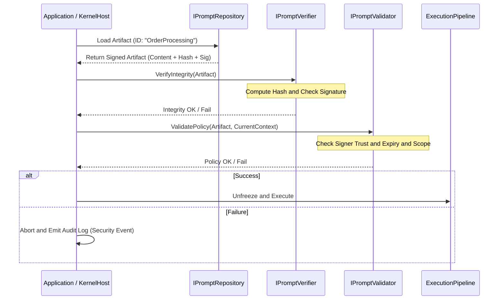

# Signed Prompt Governance Workflow
プロンプト、制約、およびパイプライン構成に対する Fail-Closed（失敗時閉鎖）検証シーケンスと、そのガバナンス構造を定義する。

## 1. Goal
LLM アプリケーションにおけるプロンプトは、従来システムにおけるコードと同等の実行権限を持つ。AIKernel はこれを署名付きアーティファクトとして扱い、次を実現する。

- 実行権限の厳格化: 承認・署名されたプロンプトのみを実行対象とする。
- 改ざん検知: 保存時/転送時の改変を検出し即時遮断する。
- エンタープライズ監査: 誰が、いつ、どの意図を承認したかを暗号学的に証明可能にする。

## 2. Actors and Responsibilities

### 2.1 `IPromptRepository`
- 責務: 署名済みプロンプトアーティファクト（Markdown + YAML Metadata）の保管と提供。
- 特記: Git またはセキュア DB と連携し、版管理された成果物を供給する。

### 2.2 `IPromptSignatureProvider`
- 責務: PKI 等に基づく署名生成と署名検証を行う。

### 2.3 `IPromptHashCalculator`
- 責務: プロンプト本文、制約、パイプライン構造を正規化し、一意ハッシュを算出する。

### 2.4 `IPromptVerifier`
- 責務: 署名の正当性と整合性（改ざん有無）を検証する。

### 2.5 `IPromptValidator`
- 責務: 署名者権限、有効期限、実行スコープなどの認可ポリシーを検証する。

### 2.6 `ISignatureTrustStore`
- 責務: 信頼済み署名者、鍵失効、証明書有効期限などの信頼アンカー情報を解決し、`IPromptVerifier` / `IPromptValidator` に提供する。

## 3. Verification Sequence (Detailed)


## 4. Rejection Triggers (拒否条件)
以下のいずれかに該当した場合、実行を拒否する。

1. Missing Signature: `signature` フィールド欠落。
2. Hash Mismatch: 現在本文から算出したハッシュと署名対象ハッシュが不一致。
3. Untrusted Signer: 署名証明書が信頼済み署名者リスト外。
4. Scope Violation: 許可スコープ（例: Read-Only）と要求操作（例: Delete）が不一致。
5. Expiration: `expires_at` を超過。

## 5. Fail-Closed Rule (安全側停止)
AIKernel は「疑わしきは停止」を原則とする。

- Indeterminate State: 検証中の外部認証系障害や例外時は `Deny` とする。
- No Fallback: 失敗時に警告付き続行モードは提供しない。
- Signature Mandatory for Production: Debug を除き、未署名プロンプトの読み込みを無効化する。

## 6. Artifact Example (Markdown and YAML)
```yaml
---
version: 1.0.2
id: "task-analyzer"
signer: "governance-team-01"
hash_alg: "SHA256"
hash: "a1b2c3d4..."
signature: "MEUCIQ..."
policy:
  max_token_budget: 4000
  allowed_tools: ["search", "calculator"]
---
# Task Analyzer
...prompt body...
```
---

# 変更履歴
- v0.0.0 / v0.0.0.0: 初期ドラフト
- v0.0.1 (2026-05-06): ドキュメント規約に基づくバージョン更新
