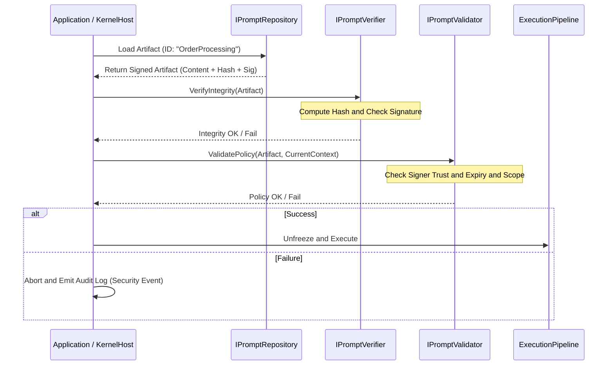

# Signed Prompt Governance Workflow
Defines the fail-closed verification sequence and governance structure for prompts, constraints, and pipeline configurations.

## 1. Goal
In LLM applications, prompts effectively carry code-level execution authority. AIKernel treats prompts as signed artifacts, not plain text, to provide:

- Strict execution authorization: only approved and signed prompt artifacts are executable.
- Tamper detection: prompt or constraint modifications during storage/transfer are blocked immediately.
- Enterprise auditability: who approved which intent and when is provable through cryptographic trust chains.

## 2. Actors and Responsibilities

### 2.1 `IPromptRepository`
- Responsibility: store and serve signed prompt artifacts (Markdown + YAML metadata).
- Note: integrates with Git or secure DBs for versioned artifact loading.

### 2.2 `IPromptSignatureProvider`
- Responsibility: generate and verify digital signatures using PKI-like trust infrastructure.

### 2.3 `IPromptHashCalculator`
- Responsibility: compute canonical hashes from prompt text, constraints, and pipeline structure.

### 2.4 `IPromptVerifier`
- Responsibility: verify artifact integrity and tamper absence.

### 2.5 `IPromptValidator`
- Responsibility: validate signer authorization, expiry window, and execution scope policy.

## 3. Verification Sequence (Detailed)


## 4. Rejection Triggers
Execution is denied if any of the following is true.

1. Missing Signature: artifact lacks `signature` field.
2. Hash Mismatch: recomputed prompt hash differs from signed hash.
3. Untrusted Signer: signer certificate is not in trusted signer registry.
4. Scope Violation: signed scope (for example Read-Only) conflicts with requested operation (for example Delete).
5. Expiration: `expires_at` has passed.

## 5. Fail-Closed Rule
AIKernel governance follows "when in doubt, stop."

- Indeterminate State: auth server outage or verifier exception yields `Deny`.
- No Fallback: no warning-and-continue mode is allowed.
- Signature Mandatory for Production: unsigned prompt loading is disabled in production environments.

## 6. Artifact Example (Markdown and YAML)
```yaml
---
version: 1.0.2
id: "task-analyzer"
signer: "governance-team-01"
hash_alg: "SHA256"
hash: "a1b2c3d4..."
signature: "MEUCIQ..."
policy:
  max_token_budget: 4000
  allowed_tools: ["search", "calculator"]
---
# Task Analyzer
...prompt body...
```
