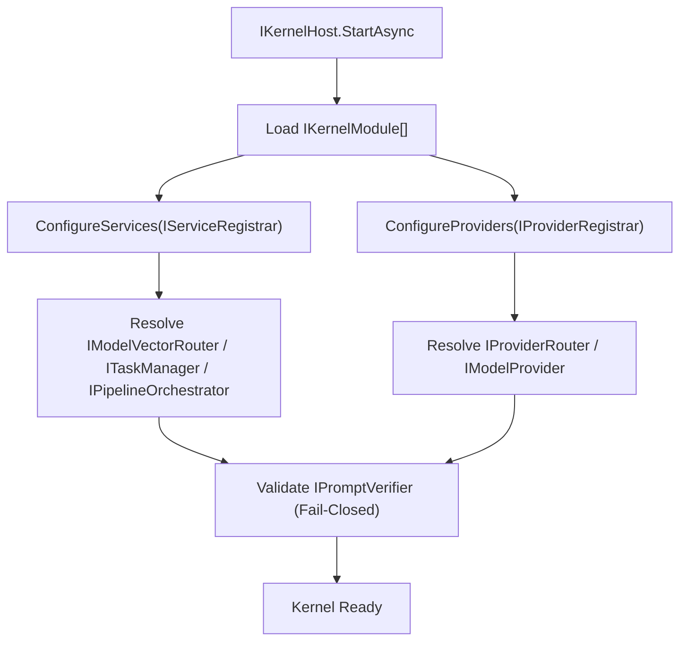

# DI Composition and Pipeline Bootstrap
この文書は、AIKernel.NET が依存性注入（DI）でモデル Provider とパイプライン実行を構成しつつ、Fail-Closed 統治と 3 層隔離を維持する方法を定義する。

---

# 1. Purpose

AIKernel における DI は単なる配線手段ではない。  
以下を実現するためのアーキテクチャ制御面である。

- 決定論的なモジュール構成
- ユースケースを変更しない Provider/Router 差し替え
- Orchestration / Material / Expression 境界の明示的維持
- Fail-Closed な起動時検証

---

# 2. Composition Contracts

DI ベースの構成フローは、次の抽象を中心に構成される。

- `IServiceRegistrar`
- `IProviderRegistrar`
- `IKernelModule`
- `IKernelHost`

各モジュールは `IKernelModule` を通してサービスと Provider を登録し、`IKernelHost` がそれらを実行可能な Kernel に組み上げる。

---

# 3. Model Selection and Provider Binding

モデルルーティングは差し替え可能な戦略として構成する。

- `IModelVectorRouter` がタスク要件から Provider/Model 経路を選定する。
- `IProviderRouter` が具体 Provider インスタンスを解決する。
- `IModelProvider` が Provider 非依存契約でモデル推論を実行する。

これにより、モデル選定責務とモデル実行責務を分離できる。

---

# 4. Pipeline Bootstrap

パイプライン動作は、計画と実行を分離した契約で組み立てる。

- `IStructurePlanner`
- `IPipelineStep`
- `IPipelineOrchestrator`
- `ITaskManager`

Kernel Host は起動時にこれらを合成し、Provider セットや統治ポリシーが異なっても同一ユースケースフローを実行できる。

---

# 5. Fail-Closed Governance in DI

Prompt 統治はランタイム開放前に必ず検証されなければならない。

- `IPromptVerifier` を必須ゲートとして扱う。
- 署名なし、または検証不能な Prompt Artifact は実行不可とする。
- Prompt 実行を伴うモジュールは、統治依存が不足している場合に起動失敗とする。

これにより、統治要件を「実行時努力目標」ではなく「構成時保証」に変換できる。

---

# 6. Reference Bootstrap Sequence

---

# 7. Design Constraints

- DI 構成は `IPromptVerifier` を迂回してはならない。
- Provider 固有の資格情報や endpoint literal を抽象層へ漏らしてはならない。
- `ContextFragment` と `IContextCollection` の境界を合成サービス内でも明示維持する。
- Provider や Planner の差し替えでユースケース契約変更を要求してはならない。

---

# 8. Architectural Outcome

Provider とパイプラインを DI 契約で構成することで、AIKernel は次を実現する。

- モデル非依存の実行経路
- ポリシー強制された起動挙動
- モジュール単位の可搬デプロイ
- 境界明示を伴う再現可能なオーケストレーション
---

# 変更履歴
- v0.0.0 / v0.0.0.0: 初期ドラフト
- v0.0.1 (2026-05-06): ドキュメント規約に基づくバージョン更新
