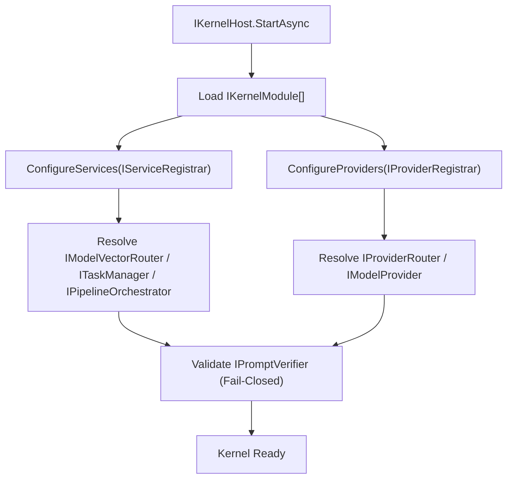

# DI Composition and Pipeline Bootstrap
This document defines how AIKernel.NET composes model providers and pipeline execution through dependency injection (DI), while preserving fail-closed governance and three-layer isolation.

---

# 1. Purpose

DI in AIKernel is not only a convenience for wiring objects.  
It is an architectural control surface for:

- deterministic module composition
- provider and router replacement without changing use cases
- explicit boundary enforcement between Orchestration / Material / Expression
- fail-closed startup validation

---

# 2. Composition Contracts

The DI-based composition flow is built around these abstractions:

- `IServiceRegistrar`
- `IProviderRegistrar`
- `IKernelModule`
- `IKernelHost`

Each module registers services and providers through `IKernelModule`, and `IKernelHost` builds a runnable kernel from those registrations.

---

# 3. Model Selection and Provider Binding

Model routing is composed as a replaceable strategy:

- `IModelVectorRouter` selects a provider/model path from task requirements.
- `IProviderRouter` resolves concrete provider instances.
- `IModelProvider` executes model interaction through provider-neutral contracts.

This keeps model selection and model execution decoupled.

---

# 4. Pipeline Bootstrap

Pipeline behavior is assembled through contracts that separate planning and execution:

- `IStructurePlanner`
- `IPipelineStep`
- `IPipelineOrchestrator`
- `ITaskManager`

The kernel host composes these services during startup, so a use case can execute the same flow with different provider sets or orchestration policies.

---

# 5. Fail-Closed Governance in DI

Prompt governance must be validated before runtime flow is opened:

- `IPromptVerifier` is treated as a mandatory gate.
- unsigned or unverifiable prompt artifacts are non-runnable.
- modules that require prompt execution must fail startup if governance dependencies are missing.

This turns governance requirements into composition-time guarantees.

---

# 6. Reference Bootstrap Sequence

---

# 7. Design Constraints

- DI composition must not bypass `IPromptVerifier`.
- provider-specific credentials or endpoint literals must not leak into abstractions.
- `ContextFragment` and `IContextCollection` boundaries must remain explicit in composed services.
- replacement of a provider or planner must not require changes in use-case contracts.

---

# 8. Architectural Outcome

By composing providers and pipelines through DI contracts, AIKernel achieves:

- model-agnostic execution paths
- policy-enforced startup behavior
- portable module-based deployment
- reproducible orchestration with explicit boundaries

