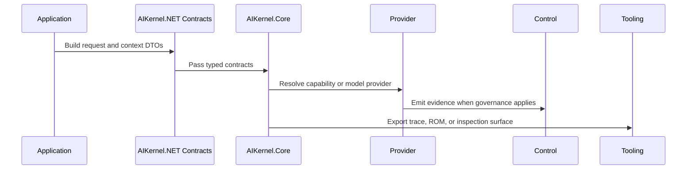

# Data Flow

## 概要

Data Flow は application code から contract、runtime routing、provider execution、control evidence、inspection tools へ情報が流れる経路を説明します。

## 背景

この project には多くの DTO と interface があるため、各 type がどこで使われるかを flow として理解する必要があります。

## 使い方

Core、Providers、Control、Tools をひとつの workflow として接続する場合に読みます。

## 例

## 補足

- The diagram is conceptual and source-backed by package boundaries, not a claim about one mandatory call stack.
- Tests in each repo remain the authority for expected behavior.
- Reference pages include source paths for deeper inspection.

## 関連ページ

- [Runtime Lifecycle](../runtime/lifecycle.md)
- [Messages](../concepts/messages.md)
- [Reference](/reference/)
