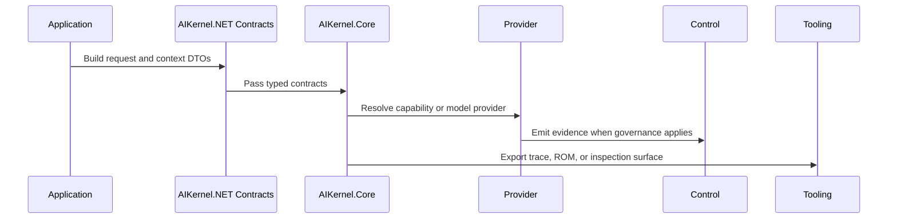

# Data Flow

## Summary

### EN

Data Flow describes how information moves from application code into contracts, runtime routing, provider execution, control evidence, and inspection tools.

### JA

Data Flow は application code から contract、runtime routing、provider execution、control evidence、inspection tools へ情報が流れる経路を説明します。

## Why

### EN

The project contains many DTOs and interfaces; readers need a flow narrative to understand where each type participates.

### JA

この project には多くの DTO と interface があるため、各 type がどこで使われるかを flow として理解する必要があります。

## Usage

### EN

Read this page when connecting Core, Providers, Control, and Tools in one workflow.

### JA

Core、Providers、Control、Tools をひとつの workflow として接続する場合に読みます。

## Examples

## Notes

- The diagram is conceptual and source-backed by package boundaries, not a claim about one mandatory call stack.
- Tests in each repo remain the authority for expected behavior.
- Reference pages include source paths for deeper inspection.

## See Also

- [Runtime Lifecycle](../runtime/lifecycle.md)
- [Messages](../concepts/messages.md)
- [Reference](/reference/)
