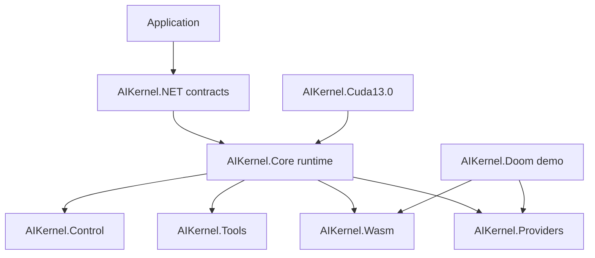

# Architecture

## Summary

### EN

Architecture explains how the repositories cooperate without collapsing contracts, runtime behavior, provider logic, and demos into one package.

### JA

Architecture は contract、runtime behavior、provider logic、demo を単一 package に混ぜないための repository 関係を説明します。

## Why

### EN

Clear boundaries are essential because package release, Reference generation, and runtime composition are maintained separately.

### JA

package release、Reference generation、runtime composition は別々に保守されるため、境界を明確にすることが重要です。

## Usage

### EN

Use the architecture pages before moving APIs between packages or adding new provider/runtime dependencies.

### JA

API の移動や provider/runtime dependency 追加の前に architecture page を確認します。

## Examples

| Module | Role | Version evidence | NuGet packages | Python packages | Public types | Tests | Source evidence |
|---|---|---:|---:|---:|---:|---:|---|
| `AIKernel.NET` | Contract packages and canonical interface surface. The 0.1.2 line adds the cognition pipeline interface surface while keeping DTO, enum, contract, and abstraction ownership separated. | `0.1.2` | 4 | 0 | 1065 | 1 | `AIKernel.NET/Directory.Build.props` |
| `AIKernel.Core` | Runtime and kernel implementation packages: hosting, VFS providers, kernel facade, fail-closed routing, and common runtime helpers. | `0.1.2` | 4 | 1 | 193 | 3 | `AIKernel.Core/Directory.Build.props` |
| `AIKernel.Control` | Physical execution and governance layer. It contains Control Core, CPU, GPU, Emulator, and Diagnostics packages for CTG-style execution evidence. | `0.1.2` | 6 | 1 | 62 | 1 | `AIKernel.Control/Directory.Build.props` |
| `AIKernel.Providers` | Official extension provider set. Provider-specific behavior is kept outside Core and is exposed through standard, chat, compute, pipeline, local LLM, and Microsoft AI packages. | `0.1.2` | 12 | 1 | 223 | 13 | `AIKernel.Providers/Directory.Build.props` |
| `AIKernel.Tools` | Developer and operations tools: CLI, inspectors, instrumentation, ROM export, replay helpers, and VFS/kernel-clock inspection. | `0.1.2` | 6 | 1 | 40 | 1 | `AIKernel.Tools/Directory.Build.props` |
| `AIKernel.Wasm` | Browser and WebAssembly runtime surface for process, memory, file system, WebGPU, audio, display, HUD, input, perception, and spatial packages. | `0.1.2` | 9 | 1 | 119 | 2 | `AIKernel.Wasm/Directory.Build.props` |
| `AIKernel.Doom` | Official source demo that models DOOM as a WASM process supervised by AIKernel-style provider, operator, consent, and perception boundaries. | `0.1.1.1` | 7 | 0 | 45 | 1 | `AIKernel.Doom/Directory.Build.props` |
| `AIKernel.Cuda13.0` | External Capability package for Windows win-x64, LibTorch 2.12.0, and CUDA 13.0. CUDA runtime concerns stay outside Core. | `0.1.2` | 1 | 1 | 7 | 1 | `AIKernel.Cuda13.0/src/AIKernel.Cuda13.0.Libtorch2.12.win-x64/AIKernel.Cuda13.0.Libtorch2.12.win-x64.csproj` |

## Notes

- The graph is generated from repository roles and package metadata.
- It intentionally shows `AIKernel.Doom` as a demo surface, not as a canonical contract owner.
- Existing deeper architecture papers remain published under the legacy architecture/theory paths.

## See Also

- [System Architecture](system-architecture.md)
- [Module Map](module-map.md)
- [Data Flow](data-flow.md)
