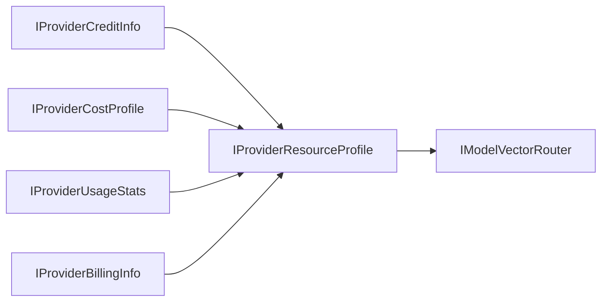

英語版は `IProviderResourceProfile.md` を参照。

# IProviderResourceProfile

## Responsibility
Provider のクレジット、コスト、利用状況、請求状態を統合し、Orchestration が直接参照可能な単一プロファイルとして提供する。

## プロパティ一覧
| Property | Type | 説明 |
| --- | --- | --- |
| `ProviderId` | `string` | Provider 識別子。 |
| `CreditInfo` | `IProviderCreditInfo` | 残高と予算境界情報。 |
| `CostProfile` | `IProviderCostProfile` | 価格ベクトル。 |
| `UsageStats` | `IProviderUsageStats` | 実行時消費テレメトリ。 |
| `BillingInfo` | `IProviderBillingInfo` | 請求サイクルと支払状態。 |
| `HealthScore` | `double` | 正規化された実行健全性スコア。 |
| `UpdatedAtUtc` | `DateTimeOffset` | 統合情報の最終更新時刻。 |

## 利用シナリオ（Use Cases）
- UC-23 AI クレジット管理
- UC-19 マルチモデル並列推論
- UC-22 モデル間補完推論

## `IModelVectorRouter` との連携
`IModelVectorRouter` は `IProviderResourceProfile` を複合制約ベクトルとして使用する。
- 能力スコア: `IProviderCapabilities`
- 経済スコア: `CostProfile` と `CreditInfo`
- 実行圧力スコア: `UsageStats`
- リスク減点: `BillingInfo` と `HealthScore`

## 円グラフ UI に必要なデータ項目
- cost composition: `CostProfile` の input/output/compute/storage
- credit composition: `CreditInfo` の available/reserved/consumed
- usage composition: `UsageStats` の request/input-token/output-token
- billing risk composition: `BillingInfo` の active/forecast/risk
- ラベル: `ProviderId`, `HealthScore`, `UpdatedAtUtc`

## 統合フロー（Mermaid）

