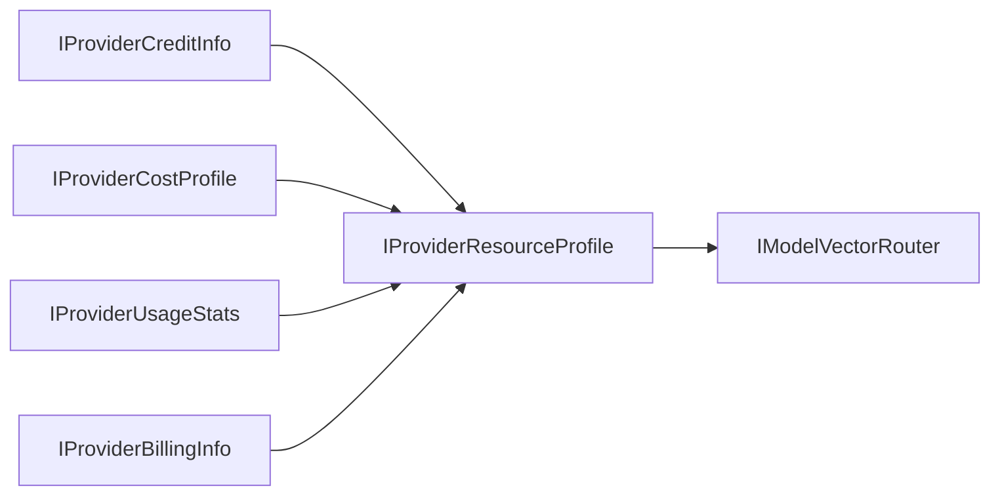

英語版は [IProviderResourceProfile.md](./IProviderResourceProfile.md) を参照。

# IProviderResourceProfile (統合リソースプロファイル仕様)

## 1. 責務の境界 (Responsibility Boundary)
`IProviderResourceProfile` は、クレジット・コスト・利用実績・請求状態を統合し、実行判断の単一参照窓口を提供する境界インターフェースです。

- 役割:
  経済・運用メタデータを横断的に束ね、Routerが最終判断できる完全コンテキストを提供します。
- 非役割:
  下位情報の収集ロジック自体は各個別プロファイルの責務です。

## 2. プロパティ定義 (Properties)
| Property | Type | 説明 |
| --- | --- | --- |
| `ProviderId` | `string` | Provider 識別子。 |
| `CreditInfo` | `IProviderCreditInfo` | 残高と予算境界情報。 |
| `CostProfile` | `IProviderCostProfile` | 価格ベクトル。 |
| `UsageStats` | `IProviderUsageStats` | 実行時消費テレメトリ。 |
| `BillingInfo` | `IProviderBillingInfo` | 請求サイクルと支払状態。 |
| `HealthScore` | `double` | 正規化された実行健全性スコア。 |
| `UpdatedAtUtc` | `DateTimeOffset` | 統合情報の最終更新時刻。 |

## 3. 利用シナリオ (Use Cases)
- `UC-23` AI クレジット管理
- `UC-19` マルチモデル並列推論
- `UC-22` モデル間補完推論

## 4. `IModelVectorRouter` との連携
`IModelVectorRouter` は本プロファイルを複合制約ベクトルとして利用します。
1. 能力スコア:
   `IProviderCapabilities`
2. 経済スコア:
   `CostProfile` と `CreditInfo`
3. 実行圧力スコア:
   `UsageStats`
4. リスク減点:
   `BillingInfo` と `HealthScore`

## 5. 統合 UI へのデータ供給
- コスト構成:
  `CostProfile` の input/output/compute/storage
- クレジット状態:
  `CreditInfo` の available/reserved/consumed
- 利用実績:
  `UsageStats` の request/input-token/output-token
- 請求リスク:
  `BillingInfo` の active/forecast/risk
- メタデータ:
  `ProviderId`, `HealthScore`, `UpdatedAtUtc`

## 6. 統合フロー (Architecture)

## 7. 統治上の制約 (Governance)
- 情報の原子性:
  下位情報は可能な限り同一 `UpdatedAtUtc` 基準で統合し、矛盾判定を抑制します。
- 決定論的リプレイ:
  実行時プロファイル全項目をスナップショット保存し、選定理由の事後検証を可能にします。
---

# 変更履歴
- v0.0.0 / v0.0.0.0: 初期ドラフト
- v0.0.1 (2026-05-06): ドキュメント規約に基づくバージョン更新
