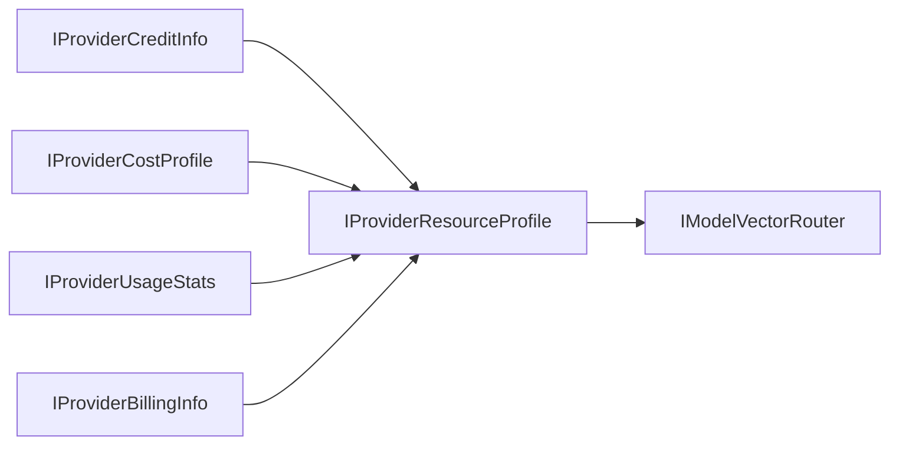

For Japanese version, see [IProviderResourceProfile-jp.md](./IProviderResourceProfile-jp.md).

# IProviderResourceProfile (Unified Resource Profile Specification)

## 1. Responsibility Boundary
`IProviderResourceProfile` aggregates credit, cost, usage, and billing dimensions into a single source of truth for final execution decisions.

- Role:
  Provide a complete economic/operational context for router scoring without cross-querying multiple interfaces.
- Non-role:
  Detailed collection logic of each sub-profile remains delegated to the corresponding lower-level contracts.

## 2. Properties
| Property | Type | Description |
| --- | --- | --- |
| `ProviderId` | `string` | Provider identifier. |
| `CreditInfo` | `IProviderCreditInfo` | Credit state and budget boundaries. |
| `CostProfile` | `IProviderCostProfile` | Pricing vector for estimation. |
| `UsageStats` | `IProviderUsageStats` | Runtime consumption telemetry. |
| `BillingInfo` | `IProviderBillingInfo` | Billing cycle and payment status. |
| `HealthScore` | `double` | Normalized provider readiness score. |
| `UpdatedAtUtc` | `DateTimeOffset` | Last aggregate update time. |

## 3. Use Cases
- `UC-23` AI credit management
- `UC-19` Parallel multi-model execution
- `UC-22` Complementary reasoning

## 4. Integration with `IModelVectorRouter`
`IModelVectorRouter` consumes this profile as a composite constraint vector:
1. Capability score:
   from `IProviderCapabilities`
2. Economic score:
   from `CostProfile` and `CreditInfo`
3. Runtime pressure score:
   from `UsageStats`
4. Risk penalty:
   from `BillingInfo` and `HealthScore`

## 5. Unified UI Data Supply
- Cost composition:
  input/output/compute/storage from `CostProfile`
- Credit composition:
  available/reserved/consumed from `CreditInfo`
- Usage composition:
  request/input-token/output-token from `UsageStats`
- Billing risk composition:
  active/forecast/risk from `BillingInfo`
- Metadata:
  `ProviderId`, `HealthScore`, `UpdatedAtUtc`

## 6. Architecture Flow

## 7. Governance Constraints
- Atomicity of view:
  Sub-profile fields should be aggregated against as-close-as-possible `UpdatedAtUtc` to reduce contradictory decisions.
- Deterministic replay:
  Persist full profile snapshots at execution time so routing decisions remain auditable and reproducible.
---

# Changelog
- v0.0.0 / v0.0.0.0: Initial draft
- v0.0.1 (2026-05-06): Version upgrade aligned with documentation guidelines
