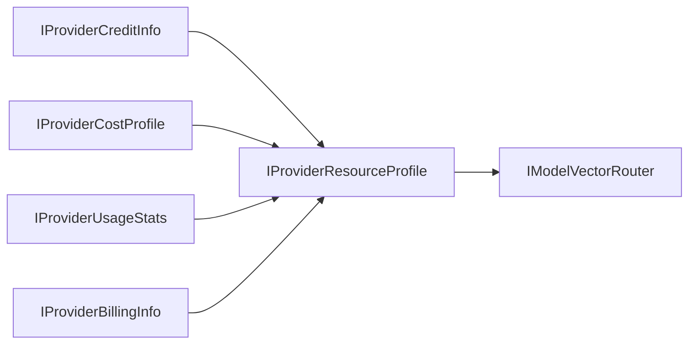

For Japanese version, see `IProviderResourceProfile-jp.md`.

# IProviderResourceProfile

## Responsibility
Aggregate provider credit, cost, usage, and billing views into a single orchestration-readable profile.

## Properties
| Property | Type | Description |
| --- | --- | --- |
| `ProviderId` | `string` | Provider identifier. |
| `CreditInfo` | `IProviderCreditInfo` | Credit state and budget boundaries. |
| `CostProfile` | `IProviderCostProfile` | Pricing vector for estimation. |
| `UsageStats` | `IProviderUsageStats` | Runtime consumption telemetry. |
| `BillingInfo` | `IProviderBillingInfo` | Billing cycle and payment status. |
| `HealthScore` | `double` | Normalized provider readiness score. |
| `UpdatedAtUtc` | `DateTimeOffset` | Last aggregate update time. |

## Use Cases
- UC-23 Provider Credit Management
- UC-19 Parallel Multi-Model Execution
- UC-22 Complementary Reasoning

## Integration with `IModelVectorRouter`
`IModelVectorRouter` consumes `IProviderResourceProfile` as a composite constraint vector:
- capability score from `IProviderCapabilities`
- economic score from `CostProfile` and `CreditInfo`
- runtime pressure score from `UsageStats`
- risk penalty from `BillingInfo` and `HealthScore`

## Pie-Chart UI Data
- cost composition: input/output/compute/storage from `CostProfile`
- credit composition: available/reserved/consumed from `CreditInfo`
- usage composition: request/input-token/output-token shares from `UsageStats`
- billing risk composition: active/forecast/risk from `BillingInfo`
- labels: `ProviderId`, `HealthScore`, `UpdatedAtUtc`

## Aggregate Flow (Mermaid)

