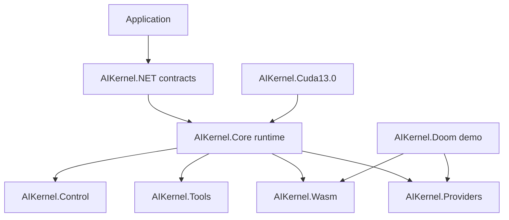

# System Architecture

## 概要

System Architecture は package の責務に焦点を当てます。contracts は定義、Core は実行、Providers は拡張、Control は統治、Tools は検査、Wasm は browser 実行隔離、Doom は demo path 検証を担います。

## 背景

生成一覧だけのページは低品質に見えやすいため、このページでは Reference へ進む前に system としての説明を与えます。

## 使い方

機能を contract から runtime package、provider/tool integration、Reference page へ辿ります。

## 例

## 補足

- Runtime behavior must not be inferred from names alone; check package descriptions and tests.
- Provider and Tool packages are extension surfaces, not contract owners.
- CUDA is optional and external to Core.

## 関連ページ

- [Runtime Model](../runtime/execution-model.md)
- [Provider Model](../providers/provider-model.md)
- [Tools](../tools/tool-model.md)
