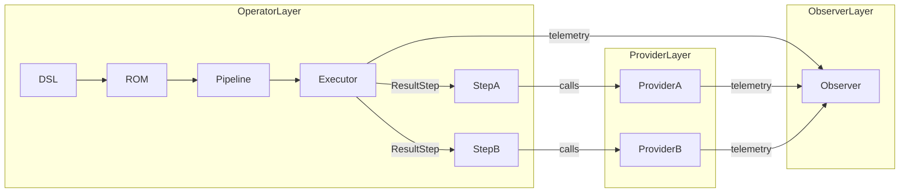

# AIKernel 開発ガイドライン  0.1.0

この文書は **AIKernel.NET** の開発規律を網羅的にまとめた正式ガイドラインです。 **契約（Interface）・意味論（Result/Option/Either）・実行（DAG Pipeline）** を厳密に分離する設計思想に、**Interface Led Architecture（ILA）** と **Provider–Observer–Operator（POO）モデル** を統合して解説します。 取りこぼしなく、実装者・設計者・レビュワーがそのまま参照できるレベルで詳細化しています。

## 概要

**目的**

- AIKernel を「AI の OS」として堅牢に保つための設計原則と実装規律を定義する。
    
- ILA によって実装の揺らぎを契約で閉じ込め、POO によって責務を明確化する。
    
- 変更は Contract と Skeleton を壊さないことを最優先とする。
    

**対象読者**

- コア開発者、プロバイダ実装者、ランタイム実装者、ツール作成者、ドキュメント担当者。
    

**用語定義（要点）**

- **Interface / Contract**: 公開 API と振る舞いの約束。ILA の中心。
    
- **Skeleton**: 実行順序を定義する DAG。Operator が実行する。
    
- **Invariant**: 実行中に破ってはならない条件。Fail‑Closed の根拠。
    
- **Provider**: 外部能力の実装ユニット（LLM, FS, Network, Compute 等）。
    
- **Observer**: 監視・監査・テレメトリ・ガバナンスを担うユニット。
    
- **Operator**: Pipeline/DAG の実行者。純粋関数的に振る舞う。
    

# ILA の全体像

## ILA の定義と目的

**ILA（Interface Led Architecture）** は次を保証するアーキテクチャ原則です。

- **Interface を第一に設計する**: すべての振る舞いは Interface として定義される。
    
- **Contract を固定する**: Contract が揺らがなければ実装の確率的振る舞いは構造内に閉じる。
    
- **Skeleton を明示する**: 実行の DAG を明確に定義し、Operator がそれを実行する。
    
- **Invariant を定義する**: 実行時に破ってはならない条件を明文化する。
    

**効果**

- 実装差分や AI による生成の不確実性を契約で吸収できる。
    
- テスト・監査・バージョン管理が容易になる。
    
- 安全性と再現性が向上する。
    

## ILA の構成要素

- **Interface（契約）**: 公開 API、型、エラー仕様、非機能要件。
    
- **Unit**: 意味的に関連する Interface の集合。
    
- **Skeleton**: Unit を接続する DAG。
    
- **Adapter**: Interface を満たす実装（Provider 側に配置）。
    
- **Invariant**: Contract の実行時条件。
    
- **Governance**: Observer による監査・検証・メトリクス。
    

# Provider Observer Operator モデル（POO）

## 役割の整理

**Provider**

- 外界との境界。LLM、ファイルシステム、ネットワーク、GPU、Python ランタイムなど。
    
- **確率的・副作用あり**の実装を内包する。
    
- Contract に従い、結果を `Result<T>` 等で返す。
    
- Adapter として Interface を実装する。
    

**Observer**

- 実行の監視・監査・ポリシー適用を担当。
    
- Telemetry、HashChain、ログ、PDP（Policy Decision Point）、Replay 検証を行う。
    
- Contract 違反や Invariant 破壊を検知し、アラートやリプレイ用データを生成する。
    

**Operator**

- Pipeline/DAG の純粋な実行者。ResultStep を順に評価する。
    
- **例外を投げない**。すべての分岐はモナドで表現する。
    
- Provider を呼び出すが、Provider の内部状態には踏み込まない。
    
- Skeleton を実行し、Contract を順守する。
    

## POO と ILA の対応

- **Interface** は Provider と Operator の共通契約。Observer はその監査対象。
    
- **Unit** は Provider/Operator の組合せで構成される。
    
- **Skeleton** は Operator の DAG。Observer は Skeleton の実行を監視する。
    
- **Invariant** は Observer と Operator が共同で守る。
    

# 詳細ガイドライン

以下は元の 10 項目を ILA と POO の観点で拡張した完全版です。各節に **目的・ルール・実装例・チェックリスト** を含めます。

## 1 正典と責務境界

**目的**

- モジュール境界を明確にし、依存関係を DAG に限定する。
    

**ルール**

- 正典は次のモジュールで構成する: **Core, Control, Providers, Wasm Runtime, Tools/CLI, Demo**。
    
- 各正典は Interface を通じてのみ相互作用する。直接的な実装依存は禁止。
    
- 正典間の依存は DAG であり、循環は厳禁。
    

**POO マッピング**

- **Core**: Operator と Observer の責務（Contract と Invariant の固定点）。
    
- **Providers**: Provider。外部能力の Adapter を配置。
    
- **Control**: Observer（ルールエンジン）。
    
- **Wasm Runtime**: Operator（実行境界）。
    
- **Tools/CLI**: Provider（ユーザーランド）と Observer（操作ログ）。
    
- **Demo**: Operator の参照 Skeleton。
    

**実装例**

- Core は `IAIKernelCore` のような Interface を公開し、実装は薄い Adapter に委譲する。
    
- Providers は `IProvider<TCapability>` を実装し、Core の `IExecutionContext` を受け取る。
    

**チェックリスト**

- [ ] モジュール間の参照が DAG になっているか。
    
- [ ] 公開 API は Interface で定義されているか。
    
- [ ] 実装が Interface を越えて直接参照していないか。
    

## 2 DAG 原則

**目的**

- 実行意味論を決定論的に保つ。
    

**ルール**

- 実行は DAG として定義する。ノードは `ResultStep`、エッジはデータ依存。
    
- 分岐はモナドで表現する。`Match` を使い、手動分岐を避ける。
    
- DAG の定義は Skeleton としてドキュメント化する。
    

**POO マッピング**

- Operator が Skeleton を実行する。Provider はノードの外側で能力を提供する。Observer は DAG 実行を監視する。
    

**実装例**

- Pipeline 定義は DSL で記述し、ROM（読み取り専用メタデータ）に保存する。
    
- 実行時は `PipelineExecutor` が DAG をトポロジカルソートして `ResultStep` を評価する。
    

**チェックリスト**

- [ ] Pipeline が DAG として表現されているか。
    
- [ ] `ResultStep` の実行は副作用を最小化しているか。
    
- [ ] 分岐はすべてモナドで表現されているか。
    

## 3 例外レス原則 Fail‑Closed

**目的**

- 内部の不整合が外部に波及しないようにする。
    

**ルール**

- コア内部で `throw` を使わない。内部は常に `Result<T>` 等で失敗を返す。
    
- `try/catch` は外界境界（Provider 呼び出し層）でのみ使用し、例外を `Result` に変換する。
    
- Observer は例外や失敗を検知してログ・リプレイデータを生成する。
    

**POO マッピング**

- Operator は例外を投げない。Provider が例外を吸収して `Result` を返す。Observer はそれを監査する。
    

**実装例**

- Provider の HTTP 呼び出しはタイムアウトや HTTP エラーを `Result<ProviderResponse>` に変換する。
    
- Core の関数は `Result<T>` を返し、呼び出し側は `Match` で処理する。
    

**チェックリスト**

- [ ] コアに `throw` が残っていないか。
    
- [ ] Provider 層で例外が `Result` に変換されているか。
    
- [ ] Observer が失敗イベントを記録しているか。
    

## 4 モナド意味論の統一

**目的**

- 分岐と文脈伝播を一貫した方法で扱う。
    

**ルール**

- 使用するモナドは `Result<T>`, `Option<T>`, `Either<L,R>`, `ResultStep` に限定する。
    
- `Match` を必ず使い、`.IsFailure` や `.Value!` のような手動参照は禁止。
    
- LINQ（Select/SelectMany）で文脈合成を行う。
    

**POO マッピング**

- Operator がモナドを使って純粋に実行する。Provider はモナド境界で結果を返す。Observer はモナドの状態を観測する。
    

**実装例**

- `PipelineExecutor` は各ステップの戻り値を LINQ で合成し、失敗があれば早期に伝播させる。
    
- `ResultStep.Match(success => ..., failure => ...)` を標準パターンとする。
    

**チェックリスト**

- [ ] 分岐がすべてモナドで表現されているか。
    
- [ ] 手動状態参照がないか。
    
- [ ] LINQ を用いた合成が適切に使われているか。
    

## 5 Interface と Adapter の分離

**目的**

- 実装の差分を契約で吸収し、破壊的変更を防ぐ。
    

**ルール**

- すべての public API は Interface で定義する。実装は薄い Adapter に委譲する。
    
- Interface は Unit の境界を表す。Interface の破壊的変更はガバナンスを通す。
    
- Adapter は Provider 側に閉じ込め、Core は Interface のみを参照する。
    

**POO マッピング**

- Provider は Adapter を実装する。Operator は Interface を通じて Provider を利用する。Observer は Interface の準拠を検査する。
    

**実装例**

- `ITextGenerationProvider` を定義し、OpenAI Adapter、LocalModel Adapter、Mock Adapter を実装する。
    
- Core は `ITextGenerationProvider` を注入して使用する。
    

**チェックリスト**

- [ ] public API が Interface で定義されているか。
    
- [ ] 実装が Interface を越えて Core を参照していないか。
    
- [ ] Adapter が Provider の副作用を閉じ込めているか。
    

## 6 バージョニング規則

**目的**

- Contract の安定性を保ち、依存関係の整合性を確保する。
    

**ルール**

- 正典の Version はすべて `0.1.0`。AssemblyVersion と FileVersion は `0.1.0.0`。
    
- ローカル開発版は `0.1.0-devX`。依存順序に従って dev 番号を進める。
    
- NuGet 参照は exact range を使う（例 `[0.1.0-dev42]`）。
    
- 破壊的変更はガバナンスプロセスを経て行う。Observer はバージョン互換性チェックを行う。
    

**POO マッピング**

- Observer が Contract 監査とバージョン互換性検査を担う。Provider は Contract に従う。Operator は Contract の実行者。
    

**実装例**

- CI パイプラインでバージョン互換性テストを実行し、破壊的変更が検出されたらマージを拒否する。
    

**チェックリスト**

- [ ] AssemblyVersion が `0.1.0.0` になっているか。
    
- [ ] NuGet 参照が exact range になっているか。
    
- [ ] 破壊的変更はガバナンス承認済みか。
    

## 7 テスト原則

**目的**

- Contract を守ることを自動化し、実行の再現性を担保する。
    

**ルール**

- 正典はすべて Release build で全テスト green を必須とする。
    
- テストカテゴリ: **Contract Tests（Operator）**, **Integration Tests（Provider）**, **Replay Tests（Observer）**, **End‑to‑End Tests（Skeleton）**。
    
- テストは CI の Gate として機能する。テストが通らない変更はマージ禁止。
    

**POO マッピング**

- Operator は Contract Tests を持つ。Provider は Integration Tests を持つ。Observer は Replay Tests を持つ。
    

**実装例**

- Contract Tests: Interface の振る舞いをモックで検証。
    
- Integration Tests: 実際の Provider を使った検証（外部依存はテスト環境で隔離）。
    
- Replay Tests: Observer が記録した実行ログを再生して同一結果を検証する。
    

**チェックリスト**

- [ ] 全正典のテストが CI で green か。
    
- [ ] Contract Tests が Interface の仕様を網羅しているか。
    
- [ ] Replay Tests が Observer のログを利用しているか。
    

## 8 DRY KISS Pure Functions

**目的**

- Core の複雑性を抑え、可検証性を高める。
    

**ルール**

- Core は副作用を持たない純粋関数を基本とする。状態は文脈（モナド）で返す。
    
- 重複コードを排除し、単一責務を守る。
    
- 複雑なロジックは小さな純粋関数に分割する。
    

**POO マッピング**

- Operator の純度を保つための規律。Provider は副作用を閉じ込め、Observer は副作用を観測する。
    

**実装例**

- ステップのロジックは `Func<Input, Result<Output>>` 型で表現する。
    
- 状態は `ExecutionContext` に集約し、変更は `Result` を通じて伝播する。
    

**チェックリスト**

- [ ] Core の関数は純粋か。
    
- [ ] 副作用は Provider に閉じ込められているか。
    
- [ ] 重複がないか。
    

## 9 ドキュメント更新

**目的**

- 設計知識を ROM として正典化し、オンボーディングと監査を容易にする。
    

**ルール**

- コード変更時は必ず関連ドキュメントを更新する。対象: Core user guide, Providers guide, Wasm runtime guide, Tools CLI guide, Demo guide。
    
- Contract、Skeleton、Invariant はドキュメントで明示する。Observer がドキュメント差分を監査する。
    

**POO マッピング**

- Observer が知識ベース（ROM）を管理し、Contract と Skeleton の外部化を担う。
    

**実装例**

- `docs/design/` に `architecture.md`, `contracts.md`, `pipelines.md` を置く。
    
- PR テンプレートに「ドキュメント更新確認」チェックを必須化する。
    

**チェックリスト**

- [ ] 変更に伴うドキュメント更新が含まれているか。
    
- [ ] Contract と Skeleton がドキュメント化されているか。
    
- [ ] Observer によるドキュメント差分チェックが CI に組み込まれているか。
    

## 10 Demo は軽量参照実装

**目的**

- Skeleton の最小実行例を示し、学習と検証を容易にする。
    

**ルール**

- Demo は依存最小で、Core の Contract と Skeleton を示すことに集中する。
    
- 実運用用の Provider は使わず、Mock Provider を使って動作を示す。
    
- Demo は Operator の実行例としてドキュメント化する。
    

**POO マッピング**

- Demo は Operator の参照 Skeleton。Observer の最小ログを含む。Provider は Mock。
    

**実装例**

- `demo/minimal` に Pipeline 定義、Mock Provider、簡易 Observer を配置する。
    
- README に実行手順と期待結果を明記する。
    

**チェックリスト**

- [ ] Demo が最小依存で動作するか。
    
- [ ] Demo が Skeleton を明確に示しているか。
    
- [ ] Demo のログが Observer によって収集されるか。
    

# 実践パターンとアンチパターン

## 実践パターン

- **Adapter Pattern for Providers**
    
    - Interface を定義し、各 Provider は Adapter を実装する。Adapter は外部 API の変換と例外吸収を行う。
        
- **Pipeline as Data Structure**
    
    - Pipeline を DSL/ROM として保存し、Executor がそれを解釈して実行する。
        
- **Contract Tests First**
    
    - Interface を先に定義し、Contract Tests を書いてから実装を進める。
        
- **Observer Replay**
    
    - 実行ログを HashChain で保存し、Replay Tests で再現性を検証する。
        

## アンチパターン

- **Core で外部 API を直接呼ぶ**
    
    - Core が Provider の実装に依存すると Contract が破壊される。
        
- **例外を内部で投げる**
    
    - 内部で `throw` を使うと Fail‑Closed が破られる。
        
- **手動状態参照**
    
    - `.IsFailure` や `.Value!` を多用するコードはバグの温床。
        
- **破壊的な Interface 変更を無承認で行う**
    
    - Contract の互換性を壊す変更はガバナンスを通す。
        

# テスト戦略と CI パイプライン

## テストカテゴリ

- **Contract Tests**: Interface の仕様を検証する単体テスト。Operator の純度を担保。
    
- **Integration Tests**: Provider の実装を実際の外部依存で検証する。テスト環境で隔離。
    
- **Replay Tests**: Observer が記録したログを再生して同一結果を検証する。
    
- **End to End Tests**: Skeleton を通した総合検証。Demo を使った最小 E2E を含む。
    

## CI Gate

- **必須チェック**: Build Release, Contract Tests green, Integration smoke tests green, Replay Tests green, Lint, Docs updated flag。
    
- **バージョンチェック**: NuGet exact range 検査、AssemblyVersion 検査。
    
- **Observer Hooks**: CI は Observer に実行メタデータを送信し、HashChain に記録する。
    

# ドキュメント構成とテンプレート

**推奨ディレクトリ構成**

```code
docs/
  architecture.md
  contracts.md
  pipelines.md
  providers.md
  wasm_runtime.md
  tools_cli.md
  demo.md
  contributing.md
```

**PR テンプレートに必須項目**

- 変更概要（What）
    
- 影響範囲（Which Units）
    
- Contract 変更の有無（Yes/No）
    
- テスト結果（CI URL）
    
- ドキュメント更新（Yes/No）
    
- Reviewer（Observer チーム）
    

# 運用上のガバナンス

- **Contract Change Process**
    
    - 破壊的変更は RFC を作成し、Observer チームと Core オーナーの承認を得る。承認ログは HashChain に記録する。
        
- **Incident Handling**
    
    - Observer が Invariant 破壊を検知したら自動で Fail‑Closed をトリガーし、インシデントチケットを作成する。
        
- **Telemetry and Privacy**
    
    - Telemetry は最小限にし、個人情報は収集しない。Observer のログはアクセス制御をかける。
        

# 付録

## マッピング一覧表

|原則|Provider|Observer|Operator|
|---|---|---|---|
|正典境界|✔|✔|✔|
|DAG|||✔|
|例外レス|✔（外界吸収）|✔（監視）|✔（内部禁止）|
|モナド|||✔|
|Interface/Adapter|✔||✔（Interface のみ参照）|
|バージョニング||✔|✔|
|テスト|✔（Integration）|✔（Replay）|✔（Contract）|
|DRY/KISS/Pure|||✔|
|ドキュメント||✔|✔|
|Demo|||✔|

## 実行フロー図（Mermaid）



## 実装チェックリスト（PR 用）

- [ ] Interface が定義されている
    
- [ ] Contract Tests が追加/更新されている
    
- [ ] Provider Adapter が副作用を閉じ込めている
    
- [ ] Operator は例外を投げていない
    
- [ ] Observer のログポイントが追加されている
    
- [ ] ドキュメントが更新されている
    
- [ ] CI が green である
    

## よくある質問と回答（短縮）

**Q: Provider が確率的な結果を返す場合、どう扱うか** A: Provider は結果を `Result<T>` にラップし、Operator はその `Result` を `Match` で扱う。確率的振る舞いは Adapter 内で吸収する。

**Q: 破壊的な Interface 変更をどう進めるか** A: RFC を作成し、Observer と Core オーナーの承認を得る。CI による互換性チェックを必須化する。

# 結び

このガイドラインは **AIKernel の思想（契約純度・DAG・モナド・Fail‑Closed）** と **ILA の方法論**、さらに **Provider–Observer–Operator の責務分離** を完全に統合したものです。 実装者はこの文書を基準に設計・実装・レビューを行ってください。必要であれば、以下の派生物を生成します。
