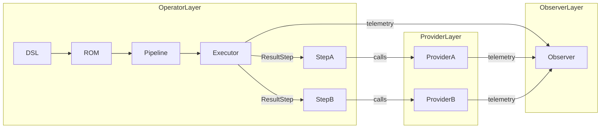

# AIKernel Development Guidelines 0.1.0

This document is the official comprehensive development guideline for **AIKernel.NET**.
It explains the design discipline that strictly separates **contracts
(interfaces), semantics (Result/Option/Either), and execution (DAG pipelines)**,
and integrates that discipline with **Interface Led Architecture (ILA)** and the
**Provider-Observer-Operator (POO) model**. It is written at a level that
implementers, designers, reviewers, and documentation contributors can use
directly without losing any required review element.

## Overview

**Purpose**

- Define the design principles and implementation discipline required to keep
  AIKernel robust as an "AI OS".
- Use ILA to confine implementation variance behind contracts, and use POO to
  clarify responsibilities.
- Treat preserving Contracts and Skeletons as the first priority of any change.

**Audience**

- Core developers, provider implementers, runtime implementers, tool authors,
  and documentation maintainers.

**Terminology (Essentials)**

- **Interface / Contract**: The public API and behavioral promise. This is the
  center of ILA.
- **Skeleton**: The DAG that defines execution order. It is executed by an
  Operator.
- **Invariant**: A condition that must not be broken during execution. It is the
  basis of fail-closed behavior.
- **Provider**: An implementation unit for external capabilities such as LLM,
  file system, network, and compute.
- **Observer**: A unit responsible for monitoring, auditing, telemetry, and
  governance.
- **Operator**: The executor of a pipeline or DAG. It behaves as a pure
  functional executor.

# Overall View of ILA

## Definition and Purpose of ILA

**ILA (Interface Led Architecture)** is an architectural principle that
guarantees the following.

- **Design interfaces first**: Every behavior is defined as an interface.
- **Freeze contracts**: If contracts do not fluctuate, probabilistic
  implementation behavior remains confined inside structure.
- **Make skeletons explicit**: Define the execution DAG clearly, and let an
  Operator execute it.
- **Define invariants**: Document the conditions that must not be broken at
  runtime.

**Effects**

- Implementation diffs and uncertainty introduced by AI generation can be
  absorbed by contracts.
- Testing, auditing, and version management become easier.
- Safety and reproducibility improve.

## Components of ILA

- **Interface (Contract)**: Public API, types, error specification, and
  non-functional requirements.
- **Unit**: A set of semantically related interfaces.
- **Skeleton**: A DAG connecting units.
- **Adapter**: An implementation that satisfies an interface and is placed on
  the Provider side.
- **Invariant**: A runtime condition required by a contract.
- **Governance**: Auditing, validation, and metrics performed by Observers.

# Provider Observer Operator Model (POO)

## Responsibility Breakdown

**Provider**

- The boundary with the external world, including LLMs, file systems, networks,
  GPUs, Python runtimes, and similar capabilities.
- Encapsulates implementations that are **probabilistic or side-effecting**.
- Follows contracts and returns results through `Result<T>` and related
  primitives.
- Implements interfaces as an Adapter.

**Observer**

- Handles execution monitoring, auditing, and policy application.
- Performs telemetry, HashChain recording, logging, PDP (Policy Decision Point),
  and replay validation.
- Detects contract violations and invariant breaks, and generates alerts or
  replay data.

**Operator**

- A pure executor of pipelines and DAGs. It evaluates `ResultStep` values in
  order.
- **Does not throw exceptions**. All branches are represented by monads.
- Calls Providers, but does not enter Provider internal state.
- Executes Skeletons and follows Contracts.

## Mapping Between POO and ILA

- **Interface** is the shared contract between Providers and Operators.
  Observers audit it.
- **Unit** is composed from Provider and Operator combinations.
- **Skeleton** is the Operator DAG. Observers monitor Skeleton execution.
- **Invariant** is protected jointly by Observers and Operators.

# Detailed Guidelines

The following sections expand the original ten principles from the perspectives
of ILA and POO. Each section includes **purpose, rules, implementation examples,
and a checklist**.

## 1 Canonical Modules and Responsibility Boundaries

**Purpose**

- Clarify module boundaries and restrict dependencies to a DAG.

**Rules**

- Canonical modules are: **Core, Control, Providers, Wasm Runtime, Tools/CLI,
  and Demo**.
- Canonical modules interact only through interfaces. Direct implementation
  dependency is prohibited.
- Dependencies between canonical modules must form a DAG. Cycles are strictly
  prohibited.

**POO Mapping**

- **Core**: Operator and Observer responsibilities. It is the fixed point for
  Contracts and Invariants.
- **Providers**: Provider. It contains Adapters for external capabilities.
- **Control**: Observer. It contains rule engines.
- **Wasm Runtime**: Operator. It forms an execution boundary.
- **Tools/CLI**: Provider in user land and Observer for operation logs.
- **Demo**: Reference Skeleton for Operators.

**Implementation Examples**

- Core exposes an interface such as `IAIKernelCore`, and the implementation
  delegates to a thin Adapter.
- Providers implement `IProvider<TCapability>` and receive Core
  `IExecutionContext`.

**Checklist**

- [ ] Are module references a DAG?
- [ ] Are public APIs defined as interfaces?
- [ ] Does implementation avoid crossing interface boundaries through direct
      references?

## 2 DAG Principle

**Purpose**

- Keep execution semantics deterministic.

**Rules**

- Execution is defined as a DAG. Nodes are `ResultStep` values and edges are
  data dependencies.
- Branching is represented by monads. Use `Match`; avoid manual branching.
- DAG definitions are documented as Skeletons.

**POO Mapping**

- The Operator executes the Skeleton. Providers supply capabilities outside the
  nodes. Observers monitor DAG execution.

**Implementation Examples**

- Pipeline definitions are written in DSL and stored in ROM (read-only
  metadata).
- At runtime, `PipelineExecutor` topologically sorts the DAG and evaluates
  `ResultStep` values.

**Checklist**

- [ ] Is the pipeline represented as a DAG?
- [ ] Does `ResultStep` execution minimize side effects?
- [ ] Are all branches represented by monads?

## 3 Exceptionless Fail-Closed Principle

**Purpose**

- Prevent internal inconsistency from propagating outside the module.

**Rules**

- Do not use `throw` inside Core internals. Internal code returns failures
  through `Result<T>` and related primitives.
- `try/catch` is used only at external-world boundaries such as Provider
  invocation layers, and converts exceptions into `Result`.
- Observers detect exceptions and failures, then produce logs and replay data.

**POO Mapping**

- Operators do not throw exceptions. Providers absorb exceptions and return
  `Result`. Observers audit the results.

**Implementation Examples**

- Provider HTTP calls convert timeouts and HTTP errors into
  `Result<ProviderResponse>`.
- Core functions return `Result<T>`, and callers handle them with `Match`.

**Checklist**

- [ ] Is `throw` absent from Core internal execution paths?
- [ ] Does the Provider layer convert exceptions into `Result`?
- [ ] Does the Observer record failure events?

## 4 Unified Monad Semantics

**Purpose**

- Handle branching and context propagation consistently.

**Rules**

- The supported monads are limited to `Result<T>`, `Option<T>`,
  `Either<L,R>`, and `ResultStep`.
- Always use `Match`. Manual state access such as `.IsFailure` and `.Value!`
  is prohibited.
- Compose contexts with LINQ (`Select` / `SelectMany`).

**POO Mapping**

- The Operator executes purely with monads. Providers return results at monadic
  boundaries. Observers observe monad states.

**Implementation Examples**

- `PipelineExecutor` composes each step result with LINQ and propagates failure
  early.
- `ResultStep.Match(success => ..., failure => ...)` is the standard pattern.

**Checklist**

- [ ] Is branching represented by monads?
- [ ] Is manual state access absent?
- [ ] Is LINQ composition used where appropriate?

## 5 Interface and Adapter Separation

**Purpose**

- Absorb implementation differences through contracts and prevent breaking
  changes.

**Rules**

- Every public API is defined by an interface. Implementations delegate to thin
  Adapters.
- Interfaces represent Unit boundaries. Breaking interface changes must pass
  governance.
- Adapters are confined to Providers. Core references only interfaces.

**POO Mapping**

- Providers implement Adapters. Operators use Providers through interfaces.
  Observers inspect interface compliance.

**Implementation Examples**

- Define `ITextGenerationProvider`, then implement OpenAI Adapter, LocalModel
  Adapter, and Mock Adapter.
- Core injects and uses `ITextGenerationProvider`.

**Checklist**

- [ ] Are public APIs defined as interfaces?
- [ ] Does implementation avoid referencing beyond interface boundaries?
- [ ] Does the Adapter confine Provider side effects?

## 6 Versioning Rules

**Purpose**

- Preserve contract stability and dependency consistency.

**Rules**

- Canonical module `Version` is `0.1.0`. `AssemblyVersion` and `FileVersion`
  are `0.1.0.0`.
- Local development builds use `0.1.0-devX`. Increment dev numbers according
  to dependency order.
- NuGet references use exact ranges, for example `[0.1.0-dev42]`.
- Breaking changes go through the governance process. Observers perform version
  compatibility checks.

**POO Mapping**

- Observers perform contract audits and version compatibility checks. Providers
  follow Contracts. Operators execute Contracts.

**Implementation Examples**

- CI executes version compatibility tests and rejects merges when breaking
  changes are detected.

**Checklist**

- [ ] Is `AssemblyVersion` set to `0.1.0.0`?
- [ ] Do NuGet references use exact ranges?
- [ ] Are breaking changes approved by governance?

## 7 Testing Principle

**Purpose**

- Automate contract preservation and guarantee execution reproducibility.

**Rules**

- Every canonical module must pass all tests in Release build.
- Test categories are **Contract Tests (Operator)**, **Integration Tests
  (Provider)**, **Replay Tests (Observer)**, and **End-to-End Tests
  (Skeleton)**.
- Tests act as CI gates. Changes with failing tests cannot be merged.

**POO Mapping**

- Operators have Contract Tests. Providers have Integration Tests. Observers
  have Replay Tests.

**Implementation Examples**

- Contract Tests validate interface behavior with mocks.
- Integration Tests validate real Providers with isolated external
  dependencies.
- Replay Tests replay logs recorded by Observers and verify identical results.

**Checklist**

- [ ] Are tests green for all canonical modules in CI?
- [ ] Do Contract Tests cover interface specifications?
- [ ] Do Replay Tests use Observer logs?

## 8 DRY KISS Pure Functions

**Purpose**

- Keep Core complexity low and improve verifiability.

**Rules**

- Core is based on side-effect-free pure functions. State is returned as
  context through monads.
- Remove duplicated code and preserve single responsibility.
- Split complex logic into small pure functions.

**POO Mapping**

- This discipline preserves Operator purity. Providers confine side effects.
  Observers observe side effects.

**Implementation Examples**

- Step logic is represented as `Func<Input, Result<Output>>`.
- State is gathered in `ExecutionContext`, and changes propagate through
  `Result`.

**Checklist**

- [ ] Are Core functions pure?
- [ ] Are side effects confined to Providers?
- [ ] Has duplication been removed?

## 9 Documentation Updates

**Purpose**

- Canonicalize design knowledge as ROM and make onboarding and audits easier.

**Rules**

- Code changes must update related documentation. Targets include Core user
  guide, Providers guide, Wasm runtime guide, Tools CLI guide, and Demo guide.
- Contracts, Skeletons, and Invariants are made explicit in documentation.
  Observers audit documentation diffs.

**POO Mapping**

- Observers manage the knowledge base (ROM) and externalize Contracts and
  Skeletons.

**Implementation Examples**

- Place `architecture.md`, `contracts.md`, and `pipelines.md` under
  `docs/design/`.
- Require a "documentation updated" checklist item in PR templates.

**Checklist**

- [ ] Does the change include related documentation updates?
- [ ] Are Contracts and Skeletons documented?
- [ ] Is Observer-based documentation diff checking integrated into CI?

## 10 Demo as Lightweight Reference Implementation

**Purpose**

- Show the smallest executable Skeleton example and make learning and
  validation easier.

**Rules**

- Demo has minimal dependencies and focuses on showing Core Contracts and
  Skeletons.
- Demo does not use production Providers. It uses Mock Providers to show
  behavior.
- Demo is documented as an Operator execution example.

**POO Mapping**

- Demo is the reference Skeleton for Operators. It includes minimal Observer
  logs. Providers are mocked.

**Implementation Examples**

- Place pipeline definitions, Mock Provider, and simple Observer under
  `demo/minimal`.
- README documents execution steps and expected results.

**Checklist**

- [ ] Does Demo run with minimal dependencies?
- [ ] Does Demo clearly show the Skeleton?
- [ ] Are Demo logs collected by an Observer?

# Practical Patterns and Anti-Patterns

## Practical Patterns

- **Adapter Pattern for Providers**
  - Define an interface, and each Provider implements an Adapter. The Adapter
    performs external API conversion and exception absorption.
- **Pipeline as Data Structure**
  - Store pipelines as DSL/ROM and let the Executor interpret and execute them.
- **Contract Tests First**
  - Define interfaces first, then write Contract Tests before implementation.
- **Observer Replay**
  - Store execution logs with HashChain and validate reproducibility through
    Replay Tests.

## Anti-Patterns

- **Calling external APIs directly from Core**
  - If Core depends on Provider implementation, the Contract is broken.
- **Throwing exceptions internally**
  - Internal `throw` breaks fail-closed behavior.
- **Manual state access**
  - Code that frequently uses `.IsFailure` or `.Value!` is a common source of
    bugs.
- **Unapproved breaking interface changes**
  - Changes that break Contract compatibility must pass governance.

# Testing Strategy and CI Pipeline

## Test Categories

- **Contract Tests**: Unit tests validating interface specifications and
  Operator purity.
- **Integration Tests**: Tests validating Provider implementations with real
  external dependencies isolated in the test environment.
- **Replay Tests**: Tests replaying Observer-recorded logs and verifying
  identical results.
- **End to End Tests**: Comprehensive Skeleton validation, including minimal E2E
  through Demo.

## CI Gate

- **Required checks**: Release build, Contract Tests green, Integration smoke
  tests green, Replay Tests green, lint, and docs-updated flag.
- **Version checks**: NuGet exact range checks and AssemblyVersion checks.
- **Observer Hooks**: CI sends execution metadata to Observers and records it in
  HashChain.

# Documentation Structure and Template

**Recommended Directory Structure**

```code
docs/
  architecture.md
  contracts.md
  pipelines.md
  providers.md
  wasm_runtime.md
  tools_cli.md
  demo.md
  contributing.md
```

**Required PR Template Items**

- Change summary (What)
- Impacted scope (Which Units)
- Contract change existence (Yes/No)
- Test results (CI URL)
- Documentation update (Yes/No)
- Reviewer (Observer team)

# Operational Governance

- **Contract Change Process**
  - Breaking changes require an RFC and approval from the Observer team and Core
    owners. Approval logs are recorded in HashChain.
- **Incident Handling**
  - When an Observer detects an invariant break, it automatically triggers
    fail-closed behavior and creates an incident ticket.
- **Telemetry and Privacy**
  - Telemetry is minimal. Personal information is not collected. Observer logs
    are access controlled.

# Appendix

## Mapping Table

| Principle | Provider | Observer | Operator |
| --- | --- | --- | --- |
| Canonical boundaries | Yes | Yes | Yes |
| DAG | | | Yes |
| Exceptionless | Yes (external absorption) | Yes (monitoring) | Yes (internal prohibition) |
| Monads | | | Yes |
| Interface/Adapter | Yes | | Yes (interface-only reference) |
| Versioning | | Yes | Yes |
| Testing | Yes (Integration) | Yes (Replay) | Yes (Contract) |
| DRY/KISS/Pure | | | Yes |
| Documentation | | Yes | Yes |
| Demo | | | Yes |

## Execution Flow Diagram (Mermaid)



## Implementation Checklist (for PRs)

- [ ] Interface is defined
- [ ] Contract Tests are added or updated
- [ ] Provider Adapter confines side effects
- [ ] Operator does not throw exceptions
- [ ] Observer log points are added
- [ ] Documentation is updated
- [ ] CI is green

## FAQ (Short)

**Q: How should a Provider handle probabilistic output?**

A: The Provider wraps the result in `Result<T>`, and the Operator handles that
`Result` with `Match`. Probabilistic behavior is absorbed inside the Adapter.

**Q: How should a breaking interface change proceed?**

A: Create an RFC and obtain approval from Observers and Core owners. CI-based
compatibility checks are mandatory.

# Closing

This guideline fully integrates the **AIKernel philosophy (contract purity, DAG,
monads, fail-closed)** with the **ILA methodology** and the
**Provider-Observer-Operator responsibility separation**. Implementers should use
this document as the baseline for design, implementation, and review.
